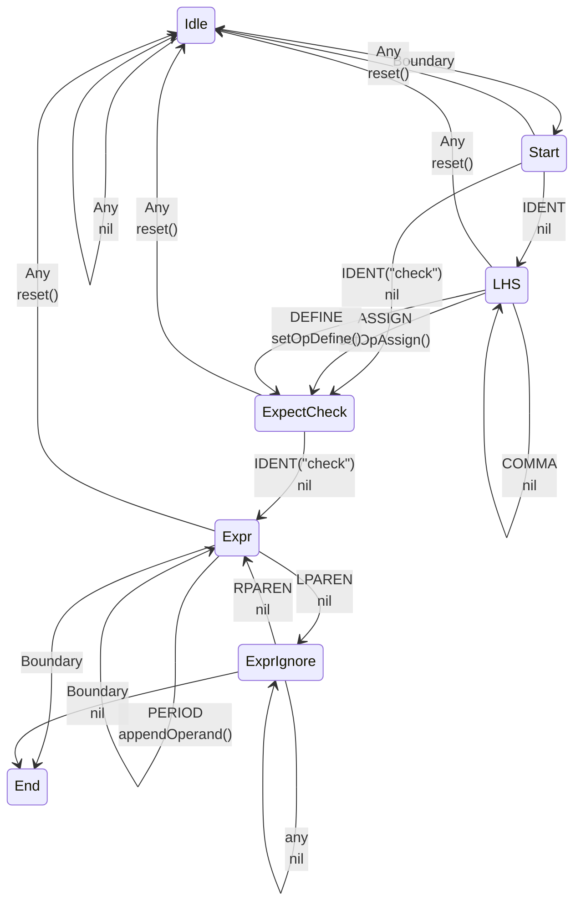

## check 

### Syntax

the `check` sugar syntax is the sugar for error handling, it looks like `[var] [assign] check <expr>`

examples
```
func something() error {
    return nil
}

// sugar
check something()

// desugar
err := something()
if err != nil {
    return [<zero>, ...] err
}

// sugar
x := check strconv.Atoi("123")

// desugar
x, err := strconv.Atoi("123")
if err != nil {
    return [<zero>, ...] err
}
```

### Lexical state machine


