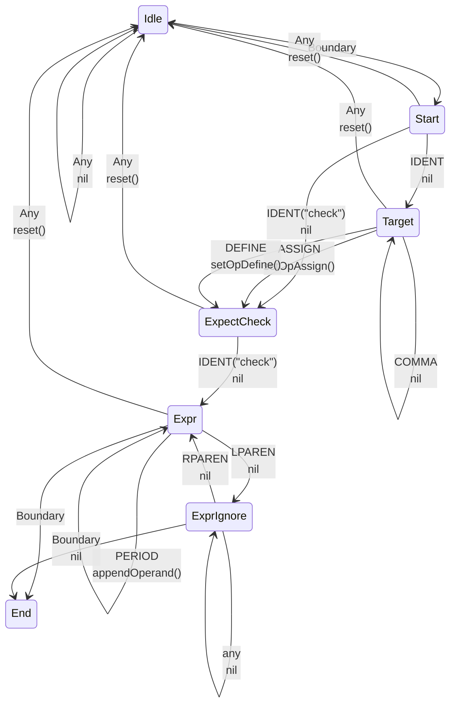
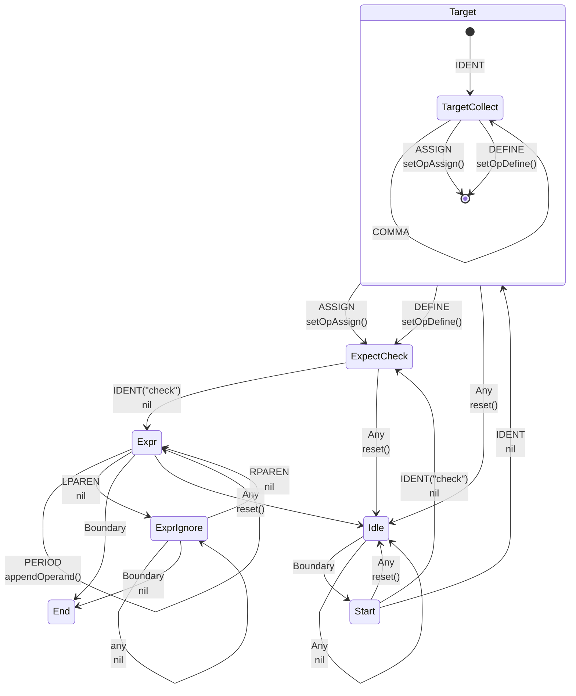

## check 

### Syntax

```ebnf
CheckStmt         = [ CheckResult ] "check" Expression

CheckResult       = CheckShortVarDecl | CheckVarDecl | CheckAssignment .
CheckShortVarDecl = IdentifierList ":=" .
CheckVarDecl      = "var" IdentifierList [ Type ] "=" .
CheckAssignment   = ExpressionList "=" .
```

examples
```
func something() error {
    return nil
}

// sugar
check something()

// desugar
err := something()
if err != nil {
    return [<zero>, ...] err
}

// sugar
x := check strconv.Atoi("123")

// desugar
x, err := strconv.Atoi("123")
if err != nil {
    return [<zero>, ...] err
}
```

### Lexical state machine



### WIP

````
full form

```ebnf
CheckStmt         = [ CheckResult ] "check" Expression [ "handle" CheckHandlerExpr ] .

CheckResult       = CheckShortVarDecl | CheckVarDecl | CheckAssignment .
CheckShortVarDecl = IdentifierList ":=" .
CheckVarDecl      = "var" IdentifierList [ Type ] "=" .
CheckAssignment   = ExpressionList "=" .

CheckHandlerExpr  = Expression . /* must have type func(error) error */
```
````

````
// group and re-use state machine - WIP


````
